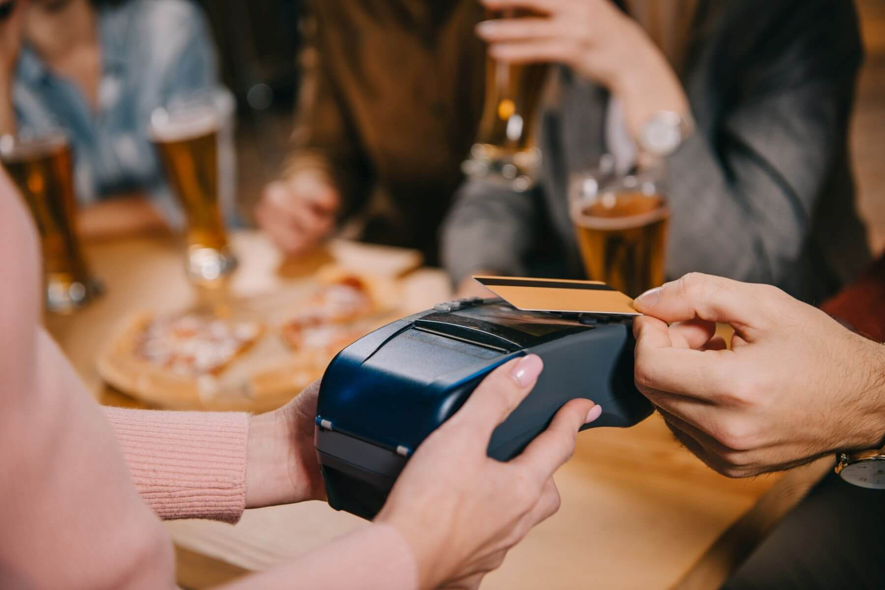

Credit card transaction fees can take a significant bite out of your restaurant or cafe's profits. As a business owner, it's important to find ways to reduce these costs without sacrificing customer convenience. We'll explore five effective strategies that can help you minimize credit card transaction fees and boost your bottom line. And towards the end, we'll discuss how Crimbolt can be a game-changer for your business.

*Slash credit card fees with savvy strategies for your restaurant or cafe.*

## Shop around for the best payment processor
Not all payment processors are created equal. Some charge higher transaction fees or have hidden costs that can add up quickly. Do your research and compare the rates and terms offered by different payment processors. Look for a provider that offers transparent pricing, low transaction fees, and no hidden charges. Don't be afraid to negotiate for better rates, especially if you have a high volume of transactions.

## Opt for a flat-rate pricing model
Some payment processors offer flat-rate pricing models, where you pay a fixed percentage for each transaction, regardless of the card type. This can be beneficial for restaurants and cafes, as it simplifies the fee structure and makes it easier to predict your monthly costs. While flat-rate pricing may not always be the cheapest option, it can provide more transparency and make budgeting easier for your business.

## Encourage customers to use debit cards or low-cost credit cards
Debit cards and certain credit cards often come with lower transaction fees compared to premium or rewards cards. Encourage your customers to use these lower-cost options by promoting them at the point of sale or even offering small incentives, like a free drink or dessert, for using a debit card or a specific low-cost credit card. This can help reduce the overall transaction fees for your business without impacting the customer experience.

## Implement a cash discount program
A cash discount program rewards customers who choose to pay with cash instead of credit cards. By offering a small discount on their bill, you can incentivize cash payments, which come with no transaction fees. This not only helps reduce credit card transaction fees but can also lead to faster checkout times and lower cash handling costs. Clearly display the cash discount at the point of sale and on your menus to ensure customers are aware of the benefits.

## Regularly review and optimize your payment processing setup
Stay informed about the latest payment processing trends and technologies. Regularly review your current setup to identify areas where you can optimize and potentially reduce transaction fees. This may include upgrading your payment terminals, improving your payment security, or switching to a more cost-effective processor. Keeping up to date with industry changes can help you stay competitive and ensure you're getting the best deal possible.

## How Crimbolt can help
Crimbolt is a payment processing app that enables businesses to accept Solana (SOL) and USDC (USD Coin) cryptocurrency payments through QR code scanning. By integrating Crimbolt into your restaurant or cafe's payment options, you can offer a modern, quick, and convenient payment method for your customers.

Here are some of the ways Crimbolt can help your business:

**Lower transaction fees:** Cryptocurrency transactions often come with lower fees compared to traditional credit card payments. By accepting payments in Solana or USDC, you can reduce your overall transaction costs and save money.

**Attract a diverse customer base:** As cryptocurrencies gain popularity, more people are looking for ways to use them for everyday transactions. Offering crypto payment options can attract tech-savvy customers who prefer to pay with digital currencies.

**Simplify currency conversion:** Crimbolt allows merchants to enter the amount they want to receive in their native currency, automatically converting it to the equivalent value in SOL or USDC based on the current exchange rate. This saves you the hassle of manually calculating conversion rates and ensures you receive the correct amount in your preferred currency.

**Enhance the customer experience:** Crimbolt's QR code payment system enables customers to make quick and contactless payments using their smartphones, providing a smooth and convenient payment experience.

In conclusion, minimizing credit card transaction fees is essential for maintaining the profitability of your restaurant or cafe. By implementing these strategies and integrating innovative payment solutions like Crimbolt, you can reduce your transaction costs, offer a better payment experience to your customers, and ultimately improve your bottom line. Stay ahead of the curve by continually evaluating your payment processing options and adopting new technologies to ensure your business remains competitive in an ever-evolving market.

Start using Crimbolt today: [crimbolt.com](https://crimbolt.com)