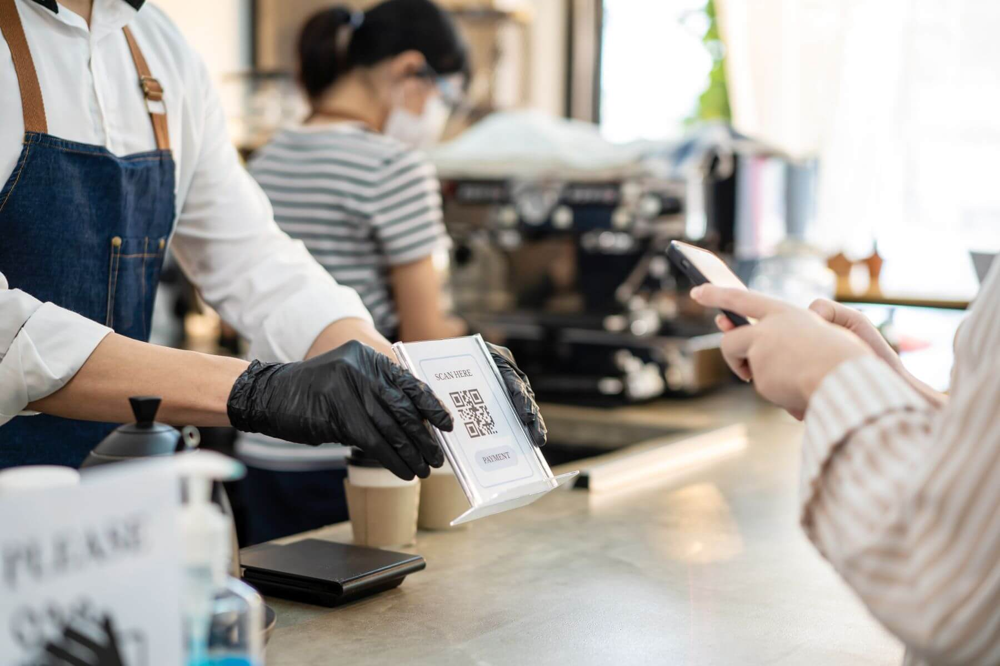

Mobile payments are revolutionizing the way customers pay for goods and services, offering a fast, convenient, and secure alternative to traditional payment methods. For restaurants and bars, adopting mobile payments can not only enhance the customer experience but also help save on credit card transaction fees, ultimately boosting profits. We'll explore the benefits of mobile payments for restaurants and bars and provide valuable insights on how to get started. Plus, we'll discuss how Crimbolt can further elevate your business and save you even more on transaction fees.

*Leverage mobile payments to cut fees and elevate customer experience.*

## The rise of mobile payments
The popularity of mobile payments has grown exponentially in recent years, with more and more consumers using their smartphones to pay for everything from groceries to dining out. For businesses, this shift presents an opportunity to embrace a new payment technology that can save them money on credit card fees while also improving the customer experience. By adopting mobile payments, restaurants and bars can tap into this trend and appeal to a broader range of customers.

## How mobile payments can reduce credit card fees
Mobile payments generally come with lower transaction fees compared to traditional credit card processing. This is because mobile payment providers have less overhead and can pass those savings on to merchants. Additionally, some mobile payment platforms use alternative currencies, such as cryptocurrencies, which can have even lower transaction fees. By integrating mobile payments into your restaurant or bar's payment options, you can reduce the overall costs associated with credit card processing and potentially boost your profit margins.

## Enhancing the customer experience with mobile payments
Mobile payments offer a seamless, contactless, and convenient payment experience for customers. By allowing patrons to pay using their smartphones, you can speed up the checkout process and eliminate the need for them to carry cash or credit cards. This can lead to increased customer satisfaction and encourage repeat business, further contributing to your establishment's profitability.

## Getting started with mobile payments
To begin accepting mobile payments at your restaurant or bar, consider the following steps:

**a. Research mobile payment providers:** Look for a provider that offers transparent pricing, low transaction fees, and an easy-to-use platform that integrates with your existing POS system.

**b. Train your staff:** Ensure that your team is familiar with the new payment system and can assist customers with using it.

**c. Promote mobile payments:** Advertise your new payment option through in-store signage, on your website, and across your social media channels to let customers know they can now pay using their smartphones.

## How Crimbolt can help

Crimbolt is a payment processing app that enables businesses to accept Solana (SOL) and USDC (USD Coin) cryptocurrency payments through QR code scanning. By integrating Crimbolt into your restaurant or bar's payment options, you can further reduce transaction fees and capitalize on the growing popularity of cryptocurrencies.

Here's how Crimbolt can benefit your business:

**Lower transaction fees:** Cryptocurrency transactions often come with lower fees compared to traditional credit card payments. By accepting payments in Solana or USDC, you can reduce your overall transaction costs and save money.

**Attract a diverse customer base:** As cryptocurrencies gain popularity, more people are looking for ways to use them for everyday transactions. Offering crypto payment options can attract tech-savvy customers who prefer to pay with digital currencies.

**Simplify currency conversion:** Crimbolt allows merchants to enter the amount they want to receive in their native currency, automatically converting it to the equivalent value in SOL or USDC based on the current exchange rate. This saves you the hassle of manually calculating conversion rates and ensures you receive the correct amount in your preferred currency.

**Enhance the customer experience:** Crimbolt's QR code payment system enables customers to make quick and contactless payments using their smartphones, providing a smooth and convenient payment experience.

In conclusion, adopting mobile payments and integrating solutions like Crimbolt can help restaurants and bars save on credit card fees, improve the customer experience, and ultimately boost profits. Stay ahead of the curve by continually evaluating your payment processing options and embracing new technologies to ensure your business remains competitive in an ever-evolving market.

Start using Crimbolt today: [crimbolt.com](https://crimbolt.com)